```mermaid
graph TD
    %% Styling definitions
    classDef backend fill:#2b3a42,stroke:#3b82f6,stroke-width:2px,color:#fff
    classDef frontend fill:#1e1e1e,stroke:#10b981,stroke-width:2px,color:#fff
    classDef bootloader fill:#3a2b42,stroke:#8b5cf6,stroke-width:2px,color:#fff
    classDef storage fill:#422b2b,stroke:#ef4444,stroke-width:2px,color:#fff
    classDef endpoint fill:#1d4ed8,stroke:#93c5fd,stroke-width:2px,color:#fff
    classDef helper fill:#2b4242,stroke:#14b8a6,stroke-width:2px,color:#fff
    classDef sse fill:#42422b,stroke:#eab308,stroke-width:2px,color:#fff
    classDef redis fill:#422b3a,stroke:#ec4899,stroke-width:2px,color:#fff

    %% --- PYTHON BACKEND ---
    subgraph Backend ["Python Backend: Event Function"]
        EventFn(["async event()"]):::endpoint --> CheckLifecycle{"Lifecycle event?"}:::backend
        CheckLifecycle -->|"function.disabling"| DisableCleanup["Strip theme + broadcast disable"]:::backend
        CheckLifecycle -->|"function.enabling"| EnableReinject["Reset _injected flag"]:::backend
        CheckLifecycle -->|"Other"| CheckInjected{"_injected?"}:::backend

        CheckInjected -->|"No"| InjectPipeline["Full Injection Pipeline"]:::backend
        CheckInjected -->|"Yes"| CheckValves{"Valve changes?"}:::backend

        CheckValves -->|"canvas_fx changed"| ToggleCanvas["Re-inject stripped state"]:::backend
        CheckValves -->|"sidebar/overlay changed"| ToggleTransparency["Re-inject CSS + broadcast"]:::backend
        CheckValves -->|"designer_url changed"| ReRegister["Re-register routes"]:::backend

        InjectPipeline --> RegisterRoute["_register_route()"]:::helper
        RegisterRoute --> FindSPA{"Find SPA catch-all"}:::backend
        FindSPA --> InsertRoutes["Insert 6 ASGI routes"]:::backend

        InjectPipeline --> InjectBoot["_inject_bootloader()"]:::helper
        InjectBoot --> FindIndex["_find_index_file()"]:::helper
        FindIndex --> GetLock["_get_index_lock() — fcntl.flock"]:::helper
        GetLock --> WriteHTML["Strip old + inject new bootloader"]:::backend

        InjectPipeline --> InjectCSS["_inject_theme_css()"]:::helper
        InjectCSS --> GetLock

        InsertRoutes --> RoutePage(["GET /theme-designer"]):::endpoint
        InsertRoutes --> RouteSave(["POST /theme-designer"]):::endpoint
        InsertRoutes --> RouteCSS(["GET /theme.css"]):::endpoint
        InsertRoutes --> RouteState(["GET /state.json"]):::endpoint
        InsertRoutes --> RouteSSE(["GET /events"]):::endpoint
        InsertRoutes --> RouteLib(["GET /library.json"]):::endpoint

        RoutePage --> RequireAdmin["_require_admin()"]:::helper
        RequireAdmin --> BuildHTML["_build_html()"]:::helper
        BuildHTML --> ServeHTML(("HTMLResponse")):::frontend

        RouteSave --> SaveCSS["_save_css()"]:::helper
        RouteSave --> SaveState["_save_state()"]:::helper
        RouteSave --> Broadcast["_broadcast_update()"]:::sse
    end

    %% --- SSE PUSH ---
    subgraph SSELayer ["Real-Time Push: Server-Sent Events"]
        Broadcast --> RedisPublish["_redis_publish()"]:::redis
        RedisPublish -.->|"Multi-worker"| RedisChannel[("Redis: theme_pro_sse")]:::redis
        RedisChannel -.-> OtherWorkers(("Other Workers")):::redis
        Broadcast --> SSEClients[("Local SSE Clients")]:::sse
        SSEClients --> Client1(("Browser 1")):::frontend
        SSEClients --> Client2(("Browser 2")):::frontend
        SSEClients --> ClientN(("Browser N")):::frontend
    end

    %% --- INJECTED BOOTLOADER ---
    subgraph Bootloader ["Injected Bootloader: Open WebUI index.html"]
        WriteHTML -.->|"Injected"| BootInit["Bootloader IIFE"]:::bootloader

        BootInit --> LoadState["Load state from server + localStorage"]:::bootloader
        BootInit --> SSEConnect["Connect to /events SSE"]:::bootloader
        BootInit --> SocketIntercept["Socket Interceptor — WebSocket token extraction"]:::bootloader
        BootInit --> ContextObs["Context Observer — MutationObserver"]:::bootloader

        SSEConnect -->|"theme-update"| Refresh["refresh()"]:::bootloader
        SSEConnect -->|"theme-disable"| StripTheme["Strip all theme CSS"]:::bootloader

        Refresh --> Enforce["enforceTheme()"]:::bootloader
        Refresh --> CanvasInit["initCanvas()"]:::bootloader

        ContextObs --> CanvasInit

        SetupListeners["SPA Navigation Listeners"]:::bootloader
        SetupListeners --> MutObs["MutationObserver: html attrs"]:::bootloader
        SetupListeners --> PopState["popstate Listener"]:::bootloader
        SetupListeners --> MediaQuery["prefers-color-scheme Listener"]:::bootloader
        SetupListeners --> StorageEvent["storage + owui-theme-updated Listeners"]:::bootloader

        MutObs --> Refresh
        PopState --> Refresh
        MediaQuery --> Refresh
        StorageEvent --> Refresh

        Enforce --> DOMUpdate(("Apply CSS to DOM")):::frontend
        CanvasInit --> CanvasRender(("Worker / Fallback Canvas")):::frontend
    end

    %% --- SERVER STORAGE ---
    subgraph ServerStorage ["Server-Side Storage: DATA_DIR/theme/"]
        SaveCSS --> CSSFile[("open_theme_designer.css")]:::storage
        SaveState --> StateFile[("open_theme_designer.json")]:::storage
        RouteCSS --> CSSFile
        RouteState --> StateFile
        RouteLib --> LibFile[("open_theme_designer_library.json")]:::storage
        GetLock --> LockFile[(".index.lock")]:::storage
    end

    %% --- DESIGNER UI ---
    subgraph DesignerUI ["Theme Designer UI: Standalone Page"]
        ServeHTML -.->|"Loads in browser"| UILoad["Initialize Designer App"]:::frontend
        UILoad --> FetchState["Fetch /state.json + /theme.css"]:::frontend
        FetchState --> Tabs{"6 UI Tabs"}:::frontend

        Tabs --> TabThemes["Themes"]:::frontend
        Tabs --> TabLCH["Core Palette"]:::frontend
        Tabs --> TabCSS["Style Overrides"]:::frontend
        Tabs --> TabCanvas["Canvas FX"]:::frontend
        Tabs --> TabBG["Gradient"]:::frontend
        Tabs --> TabCode["CSS Output"]:::frontend

        DocsBtn["📖 Docs Button"]:::frontend --> DocsModal["Documentation Modal (22 sections)"]:::frontend

        TabThemes --> CommitChange["commitChange()"]:::frontend
        TabLCH --> CommitChange
        TabCSS --> CommitChange
        TabCanvas --> CommitChange
        TabBG --> CommitChange

        CommitChange --> GenerateCSS["generateCoreCSS()"]:::frontend
        GenerateCSS --> SyncToServer["syncToServer() — POST /theme-designer"]:::frontend
        SyncToServer --> RouteSave
    end
```

# ⚡ Theme Designer Pro (Event Function)

> Instance-wide theme designer for Open WebUI — standalone admin page with server-side persistence, SSE live push, draft mode, and real-time theme enforcement across all users.


---

> [!IMPORTANT]
> **Event Function vs. Tool — Which should you use?**
>
> Theme Designer Pro is available in two forms that target different audiences:
>
> | | **Event Function** (this file) | **Tool** |
> |---|---|---|
> | **Target audience** | Server administrators | Individual users |
> | **Storage** | Server-side file persistence (instance-wide) | Browser `localStorage` (per-user, per-browser) |
> | **Theme scope** | Global — applies to all users on the instance | Personal — only affects your own browser |
> | **Requires admin** | Yes | No |
> | **SSE live push** | Yes — all connected clients update in real-time | No |
> | **Draft mode** | Yes — preview before publishing | No |
> | **Community Themes browser** | Yes — curated themes with one-click install | No |
> | **Sidebar / overlay transparency** | Yes — admin-controlled visual style valves | No |
> | **Multi-worker support** | Yes — automatic Redis pub/sub for multi-worker SSE | No |
> | **AI-driven theming** | No | Yes (`apply_theme()` tool method) |
> | **Development status** | Actively developed | Maintenance mode |
>
> **Both versions share the same core functionality** — OKLCH palette engine, Canvas FX, gradient builder, custom CSS, and snapshot library.
>
> If you're an **admin** looking for instance-wide theming, this Event Function is for you. Add the optional **[Launcher Tool](../tools/theme_designer_pro_launcher.py)** companion to open the designer directly from chat.
>
> If you're a **regular user** who wants personal theme customization without admin access, use the **[Tool variant](../tools/)**.

---

Theme Designer Pro (Event Function) is a professional-grade theming engine for Open WebUI. It registers a standalone admin page at a configurable URL (default: `/api/v1/theme-designer`), persists themes server-side, and pushes changes to all connected clients in real-time via Server-Sent Events. Powered by the modern OKLCH color space, it generates perceptually uniform color palettes across Dark, OLED, Light, and Her modes simultaneously.

Unlike the [Tool variant](../tools/) which runs inside an AI chat iframe, this variant runs as a native ASGI route — no iframe sandbox flags needed, no "Same Origin" configuration required.

---

## ✨ Key Features

- ⚡ **Server-Side Persistence:** Themes are saved to `DATA_DIR/theme/` on the server and injected into `index.html` — every user sees the same theme instantly, across all browsers and devices.
- 📡 **Real-Time SSE Push:** When you save a theme, all connected Open WebUI clients receive the update in real-time via Server-Sent Events. No page refresh required. Multi-worker deployments are supported via automatic Redis pub/sub broadcasting.
- 📝 **Draft Mode:** Preview theme changes locally in your browser before publishing to all users. Draft mode isolates changes in `sessionStorage` — other users see nothing until you publish. The designer communicates with the bootloader via a `owui-theme-updated` CustomEvent for live preview without touching `localStorage`. Click **Publish** to push to all users, or discard to revert.
- 🌈 **OKLCH Color Engine:** Harness Tailwind v4's OKLCH color spaces. Adjust Hue, Chroma, and Lightness to generate mathematically perfect, accessible tonal ramps. Hit **✦ Randomize** to generate random base colors instantly, or **◎ Extract** to upload/paste an image and calculate dominant colors using hue-histogram analysis. Locked variables are protected from both. _(Pro-Tip: Double-click any slider label to instantly reset it to its default value)._
- 🖥️☀️🌌🌙❤️ **Multi-Mode Design Engine:** Switch between System, Dark, OLED, Light, and the elusive Her mode design views using the segmented toggle. A unified OKLCH foundation ensures your colors look mathematically perfect across all environments. _(Note: The 'Her' tab dynamically reveals itself by syncing with your Open WebUI administrator's `enable_easter_eggs` configuration via the `/api/config` endpoint)._
- 🌓 **True OS Integration & System Mode:** The System mode acts as a proxy, automatically swapping between your Light and Dark designs based on Operating System preference. The engine generates CSS utilizing native `@media (prefers-color-scheme)` blocks, guaranteeing custom styles, variables, and Canvas FX seamlessly adapt even if browser class management is delayed.
- 🔄 **Selective Cross-Mode Synchronization:** Instantly duplicate your setup from one mode to another using the "Sync" button. A powerful selective sync modal allows you to copy exactly what you need — OKLCH Palette, Variable Overrides, Custom CSS, Canvas FX, Gradient Background, or Auth Visibility — to any combination of target modes simultaneously. Colored delta badges show which settings differ between modes.
- 🔄 **Live Cross-UI Detection:** If you change the Open WebUI theme natively (via OS settings or keyboard shortcuts) while the designer is open, the designer instantly switches its internal tab to match your live environment.
- 🔑 **Auth Page Theming:** Selectively opt-in your custom theme components (Foundation Colors, Custom CSS, Canvas FX, and Gradient Background) to display on the Open WebUI Login and Signup screens. Each component has an independent "Show on Auth Pages" toggle.
- 🎇 **Canvas FX Animations (Web Worker Powered):** Inject interactive JavaScript animations directly into the background of Open WebUI. Animations run on a Background Web Worker via `OffscreenCanvas` for zero-lag performance, with an automatic main-thread fallback for browsers that don't support `OffscreenCanvas`. The structural transparency layer makes native UI panels see-through so animations show behind the interface. Drag & drop `.js` files anywhere on the UI to import animations instantly.
- 🔊 **Context-Aware Animations:** Canvas FX scripts can react to conversation data in real-time. A DOM observer scans chat messages for DOM-based token estimation (~2s debounce), while a Socket.IO WebSocket interceptor extracts exact token counts from `chat:completion` responses — both feed a `context` message to the animation for data-driven visual effects. External scripts can also dispatch custom context data via the `owui-canvas-context` CustomEvent API.
- 🎭 **Community Themes Browser:** Browse and install curated community themes directly from the Themes tab. The community themes grid fetches from the [preset gallery manifest](https://github.com/silentoplayz/theme-designer-pro-presets) and supports one-click install, install-all, and search. Controlled by the `enable_community_themes` valve.
- 🪟 **Sidebar & Overlay Transparency:** Admin-configurable transparency for the sidebar and overlay UI (settings modals, dropdowns). Choose between opaque (solid), translucent (frosted glass with backdrop-blur), or transparent modes via the `sidebar_transparency` and `overlay_transparency` valves.
- 👩‍💻 **IDE-Grade Custom CSS Editor:** Write raw CSS directly within the tool. The editor features Tab trapping (2-space indent), smart auto-indentation, auto-closing pairs (brackets, quotes, parentheses), and a synced line number gutter. Save your favorite tweaks to the built-in Custom CSS Preset Gallery. A bundled "Tactical HUD" CSS preset — designed to pair with the "Tactical Liquid Grid" Canvas FX animation — ships with every fresh install as a starter example. Includes a smart parser that safely extracts and hoists `@keyframes`!
- 🛡️ **Auto-Scoped CSS Injection:** Write Custom CSS without fear of breaking other modes. The Auto-Scope toggle automatically wraps your code in the correct CSS selectors (e.g., `.dark` or `[data-theme='light']`) to ensure tweaks only apply when they should. User CSS is automatically sanitized to prevent spoofing of internal `OWUI_*` marker comments used for auth-page stripping.
- 🎯 **Variable Overrides & Manual CSS Variables:** Hand-pick and override color variables with a native color picker — each swatch features an `Aa` contrast preview badge. Click directly on any variable name to instantly copy its CSS declaration (e.g., `--color-gray-800: #1a1a2e;`). The Manual Variable Overrides code editor lets you write raw CSS custom property declarations injected _after_ the generated palette for maximum priority.
- 🔒 **Smart Locking / Pinning:** Lock specific color variables using the 🔒 icon (or bulk "Lock All" / "Unlock All" buttons). Locked colors are pinned and protected from sliders, randomization, or image extraction.
- 📋 **Smart Clipboard Parsing & Image Extraction:** Upload an image or press `Ctrl+V` to paste one from your clipboard to calculate dominant colors. The tool also features a Smart JSON paste listener — paste a Theme Designer JSON configuration, and the tool will parse and prompt you to apply it (with a security warning if untrusted Canvas FX scripts are detected).
- 🎨 **Gradient Background Builder:** Design rich CSS gradient backgrounds using the dedicated Gradient tab. Choose between linear, radial, and mesh gradient types, add and position color stops visually, control direction and intensity, and enable smooth gradient animation with configurable speed. Ships with 12 built-in gradient presets — Midnight, Emerald, Amethyst, Sapphire, Aurora (animated), Sunset, Ocean, Neon, Nebula (mesh), Lagoon (mesh), Ember (mesh), and Arctic (mesh). Save, import, and export custom gradient presets. The gradient layer applies the same structural transparency rules as Canvas FX.

- 📋 **Theme Metadata & Versioning:** Attach rich metadata when saving — Name, Description, Author, Theme Version, Target WebUI Version, Repository URL, and Theme Update URL. Metadata is embedded in exported `.json` files and preserved through imports.
- 🔄 **OTA Theme Update Checking:** Themes with a Theme Update URL can be checked for updates against a remote JSON endpoint. Use the per-snapshot ⟳ button or the global "Updates" header button to check all themes at once. Shows a detailed update modal with version comparison.
- 🌐 **Community Theme Import via URL:** Import themes directly from the web. The Import button opens a dual-mode dialog where you can paste a URL to a remote `theme.json` file, or use the classic file picker. Theme Designer Pro auto-converts `github.com` URLs to raw content.
- 📦 **JSON Viewer:** Inspect your current theme state at any time. The JSON Viewer modal displays your full configuration in a read-only, formatted code block with Copy, Collapse, and validity badge indicators.
- 📚 **Theme Library & Snapshots:** Save multiple "Snapshots" of your designs. Each snapshot captures your entire configuration (all modes, overrides, locks, manual variables, custom CSS, Canvas FX, and gradient background). Manage your library with inline Save, Import, Export, and Search buttons.
- 🔍 **Library Search, Filter & Sort:** Find saved themes using search, filter by feature tags (Custom CSS, Canvas FX, Overrides, Linked/URL themes), and sort alphabetically or by creation order. The same search and filter functionality is available in the CSS Snippet and Canvas Script galleries. Rich tooltips show name, version, author, description, and feature tags.
- 📦 **Mass Import, Export & Wipe Portability:** Download your entire snapshot library (or individual items) as smart backups. Mass-import via file picker, or drag & drop `.json`, `.js`, and `.css` files directly anywhere onto the designer window — files are automatically routed to the correct gallery (themes, canvas scripts, CSS snippets, or gradient presets). Each gallery has a "Trash" icon to wipe specific collections. Individual CSS files can also be imported and exported.
- ⏪ **Undo & Redo History:** Step backward and forward through changes using the built-in Undo/Redo footer buttons or `Ctrl+Z` / `Ctrl+Y` / `Ctrl+Shift+Z` keyboard shortcuts. Press `Escape` to close any open modal, or `Enter` to confirm the primary action.
- 📋 **CSS / Tailwind v4 Export:** The CSS Output tab provides Raw CSS and Tailwind v4 `@theme` block views, each with Minify toggle, Copy to Clipboard, and Download as `.css` file.
- 👁️‍🗨️ **Self-Adapting UI & Contrast Protection:** The designer interface dynamically themes _itself_ based on the colors you pick. Built-in contrast protection shifts text and border colors to remain legible with ultra-washed-out palettes.
- 🪄 **Native Open WebUI Aesthetic:** Meticulously designed to feel like a native part of Open WebUI, complete with custom-built, dependency-free tooltips and styled code blocks.
- 📱 **Fully Responsive:** The designer adapts to mobile screens with three responsive breakpoints (≤768px tablets, ≤480px phones, ≤390px iPhone SE) including icon-only mode for narrow header buttons.
- 💾 **Session Persistence:** The designer remembers which tab you were on via `sessionStorage`, so refreshing the page returns you to exactly where you left off.
- ⏪ **Legacy Data Migration:** Automatically detects legacy data structures and gracefully migrates saved snapshots and active themes to the latest format without data loss.
- 🔌 **Function Lifecycle Integration:** Toggling the function OFF in the admin panel triggers a clean `function.disabling` lifecycle event that strips the theme from `index.html`, broadcasts `theme-disable` to all connected clients, and clears `localStorage` — no page refresh needed. Toggling back ON triggers `function.enabling`, which re-injects the bootloader and broadcasts the theme to all clients immediately.
- ☢️ **Safe Nuclear & Factory Resets:** "Reset Mode" and "Global Reset" buttons safely clear all custom styling and restore Open WebUI to its original look. Confirmation dialogs offer pre-wipe backups. Factory Reset under the Documentation tab's Danger Zone permanently wipes all data.

---

## 🎭 Preset Gallery

A curated community collection of ready-to-import presets is available at:

**🔗 [github.com/silentoplayz/theme-designer-pro-presets](https://github.com/silentoplayz/theme-designer-pro-presets)**

### Quick Import

**Import everything at once** — paste this URL into any Import modal and click **Load URL**:

```
https://raw.githubusercontent.com/silentoplayz/theme-designer-pro-presets/main/bundles/everything.json
```

Or import individual categories:

| Bundle | URL |
|---|---|
| All Canvas FX | `https://raw.githubusercontent.com/silentoplayz/theme-designer-pro-presets/main/bundles/canvas-fx-all.json` |
| All CSS Presets | `https://raw.githubusercontent.com/silentoplayz/theme-designer-pro-presets/main/bundles/css-presets-all.json` |
| All Themes | `https://raw.githubusercontent.com/silentoplayz/theme-designer-pro-presets/main/bundles/themes-all.json` |
| All Gradients | `https://raw.githubusercontent.com/silentoplayz/theme-designer-pro-presets/main/bundles/gradients-all.json` |

You can also import individual presets by pasting any file's GitHub URL directly — Theme Designer Pro auto-converts `github.com` URLs to raw content.

---

## 🚀 Installation

1. Open your Open WebUI **Admin Panel**
2. Go to **Functions**
3. Click **Create New Function**
4. Set the Type to **Event** (not Tool, not Filter)
5. Copy the contents of [`theme_designer_pro_event.py`](theme_designer_pro_event.py) and paste it in
6. Save — the designer is now available at `/api/v1/theme-designer`

> **No sandbox flags required.** Unlike the Tool variant, this event function serves a native page via ASGI routes — no iframe, no "Same Origin" configuration needed.

> [!WARNING]
> **Running behind nginx or another reverse proxy?** You **must** add `proxy_buffering off;` to your nginx location block (or the equivalent for your proxy). Without this, SSE live push events are silently buffered and themes will only appear on the admin's browser — other users and devices will see no changes. This is the **#1 deployment issue**. See the in-app documentation (📖 Docs → Section 17: Reverse Proxy Configuration) for nginx, Caddy, Apache, and Traefik examples.

### Optional: Launcher Companion Tool

The [Launcher Tool](../tools/theme_designer_pro_launcher.py) is a lightweight companion that opens the designer page directly inside an Open WebUI chat via iframe — no need to navigate to the URL manually.

1. Go to **Workspace** > **Tools** > **Create New Tool**
2. Copy the contents of [`theme_designer_pro_launcher.py`](../tools/theme_designer_pro_launcher.py) and paste it in
3. Save — now you can ask your AI: _"Open Theme Designer Pro"_ and it renders inside the chat

> **Note:** The Launcher Tool requires the Event Function to be installed and running. It has its own `designer_url` valve that must match the Event Function's `designer_url` valve.

---

## 🛠️ Usage Instructions

1. **Navigate to the Designer:** Open your browser and go to your Open WebUI instance's designer URL (default: `/api/v1/theme-designer`)
2. **Design your Theme:**
   - Use the **Segmented Toggle** to switch between System, Dark, OLED, Light, and Her mode design views
   - Use the **Themes** tab to browse, install, and manage community themes and saved snapshots
   - Use the sliders on the **Core Palette** tab to adjust your foundation colors, override individual color variables, and lock specific shades
   - Hover and click over the **Tonal Ramp** to quickly copy mathematically generated HEX values
   - Switch to the **Style Overrides** tab to write raw CSS tweaks
   - Switch to the **Canvas FX** tab to inject interactive JavaScript background animations
   - Switch to the **Gradient** tab to design gradient backgrounds using the visual builder
   - Use the **JSON** header button to inspect or copy your full theme state
   - Use the **Updates** header button to check all your themes for available updates
3. **Draft vs. Live:** Toggle the **Draft** button in the header to preview changes locally before publishing. While in Draft mode, only your browser sees the changes. Click **Publish** to push to all users.
4. **All changes auto-save.** Every change is debounced (250ms) and automatically persisted server-side via `syncToServer()`, then broadcast to all connected clients. In Draft mode, `syncToServer()` is gated off — changes are previewed locally only.

**Pro-Tip for Custom CSS:** Not sure what to target? Press `F12` (or right-click > Inspect) to open your browser's Developer Tools. Use the element picker to find the exact class names used by Open WebUI (e.g., `.chat-bubble` or `#sidebar`).

---

## 🎨 Custom CSS: Changing Fonts

You can change the global font family for your entire Open WebUI instance by pasting a CSS rule into the **Style Overrides** tab.

Set the font on the document root and the form controls, then let it **inherit** down — form elements (`input`, `textarea`, `button`, `select`) are listed explicitly because they don't inherit `font-family` by default. Avoid painting the font onto the universal selector `*`: it clobbers icon fonts and code/math spans.

**1. The "Native OS" Vibe** (Uses San Francisco on Mac, Segoe on Windows)

```css
html,
body,
input,
textarea,
button,
select {
	font-family:
		-apple-system, BlinkMacSystemFont, 'SF Pro Display', 'Segoe UI', Roboto, Helvetica, sans-serif !important;
	letter-spacing: -0.01em !important;
}
```

**2. The "Hacker Terminal" Vibe** (Forces monospace coding fonts)

```css
html,
body,
input,
textarea,
button,
select {
	font-family: 'JetBrains Mono', 'Fira Code', 'Consolas', 'Courier New', monospace !important;
}
```

**3. The "Editorial" Vibe** (Clean, highly readable Serif font)

```css
html,
body,
input,
textarea,
button,
select {
	font-family: 'Georgia', 'Cambria', 'Times New Roman', serif !important;
	line-height: 1.65 !important;
}
```

_Paste one of these into the Style Overrides editor for your desired mode, ensure "Enabled" is checked, and watch the UI font transform instantly!_

---

## 🔧 Valve Configuration

Valves are configured in the Admin Panel under **Functions → Theme Designer Pro → ⚙️**.

#### 🎛️ Feature Toggles

| Valve | Type | Default | Description |
|---|---|---|---|
| **Enable Canvas FX** | `bool` | `true` | Allow Canvas FX (JavaScript background animations). When disabled, the Canvas FX tab is hidden and running animations are suppressed — canvas data is stripped from the saved state and a canvas-stripped update is broadcast. |
| **Enable Custom CSS** | `bool` | `true` | Allow the Style Overrides (custom CSS) editor. When disabled, the Style Overrides tab is hidden in the designer UI. |
| **Enable Gradient Builder** | `bool` | `true` | Allow the Gradient Background builder. When disabled, the Gradient tab is hidden in the designer UI. |
| **Enable Community Themes** | `bool` | `true` | Show the Community Themes browser in the Themes tab. When disabled, the community themes grid is hidden and no manifest is fetched. |

#### 🖌️ UX Policy

| Valve | Type | Default | Description |
|---|---|---|---|
| **Enable Auth Page Theming** | `bool` | `true` | Allow theming the login/signup pages. When disabled, all "Show on Auth Pages" toggles are hidden and forced off. |
| **Draft Mode Default** | `bool` | `false` | Open the designer in Draft mode by default. When enabled, the designer starts in Draft mode on every fresh page load, preventing accidental live changes. |
| **Auto Sync** | `bool` | `false` | Skip the Selective Sync modal when loading presets or syncing. When enabled, a "Sync All" toggle appears in the designer footer — turn it on to propagate changes to all modes, or leave it off to apply only to the active mode. |

#### 🎨 Visual Style

| Valve | Type | Default | Description |
|---|---|---|---|
| **Sidebar Transparency** | `Literal` | `"opaque"` | Controls sidebar background style. `"opaque"` (default) — solid background for best readability. `"translucent"` — frosted glass effect (backdrop-blur) that lets backgrounds show through. `"transparent"` — fully see-through sidebar with no blur (automatically uses translucent on mobile for readability). |
| **Overlay Transparency** | `Literal` | `"opaque"` | Controls overlay UI (settings modal, dropdowns, integration menus) background style. `"opaque"` (default) — solid background for best readability. `"translucent"` — frosted glass effect (backdrop-blur) that lets backgrounds show through. |

#### 🔒 Security

| Valve | Type | Default | Description |
|---|---|---|---|
| **Enable Canvas API Access** | `bool` | `false` | Pass the user's auth token to Canvas FX scripts. Required for context-aware scripts that make authenticated API calls. When disabled (default), scripts cannot make authenticated requests. |
| **Enable URL Import** | `bool` | `true` | Allow importing themes, CSS snippets, and canvas scripts from remote URLs. When disabled, all URL import buttons are hidden. |
| **Allowed Import Domains** | `str` | `""` | Comma-separated allowlist of domains for URL imports (e.g., `raw.githubusercontent.com, openwebui.com`). Empty = allow all. Only applies when Enable URL Import is `true`. |

#### 🛠️ Advanced

| Valve | Type | Default | Description |
|---|---|---|---|
| **Designer URL** | `str` | `/api/v1/theme-designer` | URL path where the designer and all its sub-routes are served. Must start with `/api/v1/` — paths outside this prefix are auto-corrected to prevent the SPA catch-all from intercepting the route (a warning is logged). Changing this value triggers a route re-registration and bootloader re-injection with the new URL. |

> **Note:** All Valves default to their most permissive values — the event function behaves identically to an un-valved installation out of the box. Admins only need to configure Valves if they want to restrict specific features.

> [!IMPORTANT]
> Most valve changes take effect on the **next `event()` call** (i.e., any chat message or function event). Saving valve values alone doesn't trigger re-injection — it happens the next time the event function runs. The exception is the function **ON/OFF toggle** in the admin panel, which triggers `function.disabling`/`function.enabling` lifecycle events that take effect immediately.

---

## 📖 In-App Documentation

The designer includes **22 comprehensive documentation sections** accessible via the **📖 Docs** button in the header. These cover:

1. Getting Started & Architecture
2. OKLCH Foundation & Modes
3. System Theme & OS Integration
4. Draft Mode & Publishing
5. Variable Overrides & Locks
6. Custom CSS & Auto-Scoping
7. Canvas FX Animations (incl. Worker Protocol & API contract)
8. Advanced Tools & Image Extraction
9. Libraries & Data Management
10. Theme Updates (OTA)
11. Reference: Available Variables
12. Gradient Backgrounds (incl. preset table)
13. Structural Transparency & Layer Stack
14. Keyboard Shortcuts & Editor Tips
15. Compliance & Legal Disclaimer
16. Community Presets (with import URLs)
17. Reverse Proxy Configuration
17b. Multi-Worker Deployments
18. Troubleshooting & FAQ
19. Uninstallation & Complete Removal
20. Portability & Backups
21. Danger Zone (Factory Reset)

---

## 🚀 How It Works (Under the Hood)

Theme Designer Pro uses a unique server-side injection architecture. Unlike the Tool variant which operates through an iframe and browser `localStorage`, the Event Function persists themes on the server and pushes changes to every connected client.

1. **Event-Driven Injection:**
   The `event()` entry point runs on every Open WebUI event (chat messages, system events). On first invocation or after `system.startup.completed`, it injects a bootloader script and theme CSS into the server's `index.html`. The injection is idempotent — `while` loop stripping ensures duplicate blocks from prior runs are cleaned before re-injection.

2. **The Bootloader (Injected into `index.html`):**
   A self-contained JavaScript block (~900 lines) that runs on every page load. It handles:
   - **Theme state loading:** Reads config from `localStorage` + embedded `<script#owui-theme-state>` data, fetches `/theme.css` and `/state.json` from the server. Uses a monotonic version counter to prevent stale fetch responses from overwriting fresher SSE data.
   - **SSE client:** Connects to the `/events` endpoint to receive real-time `theme-update` and `theme-disable` messages. When an update arrives, it applies the new CSS/state immediately — no page refresh needed. Uses native `EventSource` auto-reconnect with a 3-second retry interval. Includes iOS PWA resilience — re-opens the connection when the app returns to foreground after WebKit silently kills it.
   - **Socket interceptor:** Wraps the `WebSocket` constructor to attach a `message` listener on each new instance, intercepting Socket.IO v4 frames containing `chat:completion` usage data. Walks the payload recursively (up to 4 levels deep) to find `usage` objects with token counts. Dispatches `owui-canvas-context` CustomEvents with `{ exactTokens, promptTokens, completionTokens, source: 'socket' }` — zero coupling with the context observer.
   - **Context observer:** `MutationObserver` on `#messages-container` that scans `.chat-user` and `.chat-assistant` elements for DOM-based token estimation (debounced every ~2s). Navigation-aware — re-attaches when the active chat changes. Sends zero-state when navigating away from chat.
   - **Canvas FX engine:** Dual-mode execution — `OffscreenCanvas` in a Web Worker when supported, automatic main-thread fallback when not. Handles 10 message types (init, resize, mousemove, click, mousedown, mouseup, touchstart, touchmove, touchend, context); click/mousedown/mouseup listeners use the capture phase so they fire even when UI elements stop propagation. Mousemove and touchmove are rAF-coalesced for efficient cross-thread messaging. Includes iframe mouse-event bridge for the Launcher Tool.
   - **Theme enforcement:** `enforceTheme()` injects/updates CSS `<style>` blocks, `refresh()` re-applies theme and re-initializes canvas. A `MutationObserver` on `<html>` attributes + `popstate`, `storage`, and `prefers-color-scheme` listeners ensure the theme survives SPA navigations.

3. **Server-Side Persistence & FOUC Prevention:**
   Themes are saved in `DATA_DIR/theme/`:
   - `open_theme_designer.css` — the generated CSS served at `{designer_url}/theme.css`
   - `open_theme_designer.json` — the full theme state served at `{designer_url}/state.json`
   - `open_theme_designer_sections.json` — the structured CSS sections (`vars` / `structural` / `gradient` / `custom`) that consumers assemble selectively (auth-page stripping, flash-free inline subset)
   - `open_theme_designer_library.json` — the preset library All `index.html` file operations use `fcntl.flock()` for cross-process serialization — critical because Open WebUI fires multiple concurrent `event()` calls during startup.

   **FOUC prevention:** The injector embeds a safe subset of theme CSS _inline_ into `index.html` (with structural/gradient rules stripped to prevent a white flash before the canvas script loads). State JSON is also embedded directly into `index.html` as a `<script#owui-theme-state>` element — eliminating an async fetch for initial state data. The bootloader then fetches the full CSS from the server and applies the deferred rules. As a **Watchtower recovery** fallback, the bootloader also writes theme data through to `localStorage` — if `index.html` is replaced by a container image update (e.g., Watchtower), the server re-injects the bootloader on the next `event()` call, and the `localStorage` copy lets it re-apply the theme immediately even before the server files are refetched.

4. **SSE Push Architecture:**
   When the designer saves a theme, the POST handler writes CSS + state to disk and calls `_broadcast_update()`, which pushes a lightweight version token (with ETags) to all connected SSE clients (`_sse_clients`); each client then refetches `/theme.css` and `/state.json`, with ETag revalidation so unchanged files cost a cheap 304. SSE clients are stored on `app.state` to survive function hot-reloads. The `theme-disable` event type is broadcast when the admin toggles the function OFF. In multi-worker deployments, `_redis_publish()` broadcasts to the `theme_pro_sse` Redis pub/sub channel, ensuring all workers relay updates to their local SSE clients.

5. **Structural Transparency (CSS):**
   The generated CSS makes UI containers transparent so Canvas FX and gradient backgrounds show through. Transparency is scoped to `.app`, `#theme-designer-container` (the designer page root), and `#auth-page` using `:where()` selectors for zero specificity. Portaled UI (dropdown menus, modals, submenus) lives outside `.app` on `document.body` — never made transparent — so no override rules are needed.

6. **Selective Auth Page Stripping:**
   The bootloader assembles auth-page CSS from the structured sections delivered inside `state.json` (under the `_cssSections` key), honoring each feature’s independent "Show on Auth Pages" toggle (colors, custom CSS, canvas, gradient). For themes saved by older versions without sections, it falls back to slicing the flat CSS by `/*[OWUI_*]*/` marker comments.

7. **Function Lifecycle Integration:**
   When the admin toggles the function OFF, Open WebUI dispatches `function.disabling` synchronously. Theme Designer Pro uses this to strip theme CSS from `index.html`, re-inject the bootloader with `__THEME_ACTIVE__=false` (keeping SSE alive for the disable broadcast), and broadcast `theme-disable` to all connected clients. When toggled back ON, `function.enabling` triggers re-injection and broadcasts the saved theme to all clients immediately.

8. **Hot Reload Behavior:**
   When the event function is re-saved in the admin panel, `_register_route()` fires and resets `Event._injected = False`. The next `event()` call detects this and re-runs the full injection pipeline. Route registration inserts ASGI routes *before* the SPA catch-all to ensure they take priority.

---

## 🔌 API Routes

All routes are registered under the configurable `designer_url` base (default: `/api/v1/theme-designer`).

| Method | Path | Auth | Description |
|---|---|---|---|
| GET | `{designer_url}` | Admin | Serves the Theme Designer Pro HTML page |
| POST | `{designer_url}` | Admin | Saves CSS + state + library, broadcasts SSE update |
| GET | `{designer_url}/theme.css` | Public | Serves generated theme CSS (204 if inactive or missing) |
| GET | `{designer_url}/state.json` | Public | Serves saved theme state JSON (204 if inactive or missing) |
| GET | `{designer_url}/events` | Public | SSE endpoint for real-time push updates |
| GET | `{designer_url}/library.json` | Admin | Serves the preset library (themes, canvas, CSS, gradients) |

> **Graceful degradation:** Missing CSS or state files return HTTP 204 (no content), not 500 errors. Corrupted JSON is served as-is — the client handles parse errors.

---

## 🧩 Canvas FX API Contract

All Canvas FX scripts must follow this Web Worker contract:

```javascript
// Receive messages from the host
self.onmessage = (e) => {
  switch (e.data.type) {
    case 'init':       // { canvas: OffscreenCanvas, width, height, env }
    case 'resize':     // { width, height }
    case 'mousemove':  // { x, y }
    case 'click':      // { x, y }
    case 'mousedown':  // { x, y }
    case 'mouseup':    // { x, y }
    case 'touchstart': // { touches: [{x, y}, ...] }
    case 'touchmove':  // { touches: [{x, y}, ...] }
    case 'touchend':   // { touches: [{x, y}, ...] }
    case 'context':    // { messages, chars, estimatedTokens } or { exactTokens, promptTokens, completionTokens, source }
  }
};

// Send heartbeat to prevent worker termination
setInterval(() => { self.postMessage({ type: 'heartbeat' }); }, 1000);

// Use requestAnimationFrame for the render loop
// NO DOM access (no document, window, alert, localStorage)
```

> **Note:** The `init` message includes an `env` object with `{ authToken, baseUrl, locale, timezone }`. The `authToken` field is only populated when the admin enables the `enable_canvas_api_access` valve — otherwise it's an empty string.

### Dual Execution Modes

| Mode | Condition | Canvas Type |
|---|---|---|
| **Worker** | Browser supports `OffscreenCanvas` + script doesn't reference `document` | `OffscreenCanvas` transferred via `postMessage` |
| **Fallback** | No `OffscreenCanvas` support, or script throws in Worker | Standard `<canvas>` DOM element; synthetic `self` object provided |

The fallback is automatic — Worker errors are caught, the Worker is terminated, and the script is re-run on the main thread.

---

## ❓ Troubleshooting & FAQ

- **My theme disappears after a container recreate.**
  - _Reason:_ `docker compose up --force-recreate` replaces the container filesystem — `index.html` returns to stock. The theme auto-re-injects on the next `event()` call (any chat message or system event). A simple `docker restart` preserves the injected `index.html`.

- **Valve changes aren't taking effect.**
  - _Reason:_ Saving valves in the admin panel doesn't trigger `event()` directly. Send any chat message or wait for the next system event — the function detects the valve change on the next `event()` invocation.

- **The designer page returns a 404.**
  - _Fix:_ The event function registers its routes dynamically. If the function hasn't processed an event yet since the last restart, the route may not exist. Send a chat message to trigger `event()`, which registers routes on first invocation.
  - _Also check:_ Ensure the `designer_url` valve matches the URL you're navigating to.

- **My theme doesn't apply to other users.**
  - _Fix:_ Most commonly caused by **reverse proxy buffering** — see in-app Docs → Section 17. Also ensure the admin has synced the theme via the designer (not Draft mode). The bootloader serves the theme to all users on page load from `{designer_url}/theme.css`. If the theme files are missing from `DATA_DIR/theme/`, the bootloader has nothing to serve. Verify the endpoint works by navigating directly to `{designer_url}/theme.css` in your browser — it should return CSS content.

- **Canvas FX animations are lagging.**
  - _Fix:_ Heavy animations can drain resources. Ensure your browser supports `OffscreenCanvas` (indicated by the green "Background Worker" badge in the UI). If it says "Main Thread (Fallback)", keep animations simple.

- **Multiple bootloader blocks in `index.html`.**
  - _Reason:_ This was a historical bug caused by `if` checks instead of `while` loops for stripping. It's been fixed — the current code uses `while` loops. If you encounter duplicates from an old version, restarting the container or triggering a re-injection will clean them up.

- **Theme works but not on the auth/login page.**
  - _Check:_ Ensure the "Show on Auth Pages" toggles are enabled for each feature you want on auth pages (Colors, CSS, Canvas, Gradient). Also verify the `enable_auth_page_theming` valve is `true`.

- **Theme reverts after disabling the function.**
  - _Reason:_ Toggling the function OFF triggers the `function.disabling` lifecycle event, which broadcasts a `theme-disable` SSE event to strip the theme from all clients. The bootloader and CSS in `index.html` are also cleaned up. When re-enabled, the `function.enabling` event re-injects everything automatically. Follow the Uninstallation steps below for complete removal.

- **SSE connection keeps reconnecting.**
  - _Reason:_ SSE connections are long-lived. Some reverse proxies (Nginx, Cloudflare) terminate idle connections. Configure your proxy to allow long-lived connections on the `/events` endpoint, or increase proxy timeout settings.

- **Multi-worker deployment: themes only update on some users.**
  - _Fix:_ Set `REDIS_URL` in your environment (which Open WebUI already uses for WebSocket relay). Theme Designer Pro automatically uses Redis pub/sub to broadcast SSE events across all workers. No additional configuration needed.

---

## 🗑️ Uninstallation & Complete Removal

Because the event function injects a bootloader into `index.html`, **simply disabling it won't fully remove theming.** Follow these steps for complete removal:

**Step 1: Factory Reset (Purge All Data)**

The easiest way to wipe all saved data is to open Theme Designer Pro, click the **📖 Docs** button in the header, and click the red **Factory Reset (Wipe All Data)** button under the Danger Zone section (Section 21). This permanently deletes all themes, snapshots, and configuration.

**Step 2: Remove Server Files**

Delete the theme data files from your container:

```bash
docker exec <container_name> rm -f /app/backend/data/theme/open_theme_designer.*
```

**Step 3: Remove Bootloader from `index.html`**

Restart or recreate your container to restore a clean `index.html`:

```bash
docker compose down && docker compose up -d
```

> A simple restart (`docker restart`) preserves the existing filesystem — the injected bootloader remains. Use `down && up` or `--force-recreate` to get a fresh `index.html` from the image.

**Step 4: Remove the Function**

Delete the function from the Admin Panel under **Functions**.

---

## ⚖️ Compliance & Legal Disclaimer

**Theme Designer Pro is a tool provided for educational and customization purposes. By using this tool, you acknowledge and agree to the following:**

- **Compliance Responsibility:** As of Open WebUI v0.6.6+, the software license strictly prohibits altering, removing, obscuring, or replacing any "Open WebUI" branding (including the name, logo, or distinguishing visual identifiers) in deployments with **more than 50 active users** in a 30-day period without an Enterprise License.
- **Administrative Burden:** The responsibility to ensure compliance rests **entirely** with the server administrator. While modifying color palettes is permitted, you must ensure that the Style Overrides tab is not used to hide, obscure, or alter the Open WebUI logo and branding in violation of the license.
- **Liability Waiver:** The author of Theme Designer Pro (@g30) shall not be held liable for any material breach of license, legal action, or service termination resulting from use or misuse of this tool.
- **Safe Harbor:** If your deployment is for personal use, internal team use (with permission), or for an organization of 50 or fewer active users, you are generally exempt from strict branding restrictions.

This tool is provided "as is" without warranty of any kind. By using Theme Designer Pro, you acknowledge that modifying system files (`index.html`) may have implications. Use only on trusted instances.

_For more information, see the official [Open WebUI License Guide](https://github.com/open-webui/docs/blob/main/docs/license.mdx)._

---

## ⚠️ Canvas FX Performance Disclaimer

Canvas FX allows you to inject custom JavaScript animations directly into the background of Open WebUI. Animations execute on a dedicated **Background Web Worker (`OffscreenCanvas`)** by default, ensuring your chat interface remains smooth without blocking the main browser thread.

_(Note: If your browser doesn't support `OffscreenCanvas`, the engine seamlessly falls back to main-thread execution)._

Even with Web Workers, highly intensive animations (massive particle counts, heavy mathematical calculations) can consume significant CPU/GPU resources and drain battery life. Use this feature responsibly, test your scripts, and keep animations lightweight!

---

## 💡 Maintenance & Stability (PSA)

Open WebUI is a fast-moving project. Because this event function relies on `index.html` injection and DOM observation to persist themes, future UI updates to Open WebUI may require adjustments. Use the export button to back up your favorite themes regularly!

---



---

## ⚠️ Important Notes & System Requirements

- **Required Open WebUI Version:** `0.10.0` or higher (event functions were introduced in v0.10.0).
- **Admin access required** — the designer page and save endpoint enforce admin authentication.
- **Server write access** — the event function must have write access to `index.html` (automatic in default Docker deployments) and `DATA_DIR/theme/` for persistence files.
- **No sandbox flags needed** — unlike the Tool variant, no "Same Origin" iframe configuration is required.
- **No additional Python dependencies** — uses only what Open WebUI provides (`pydantic`, `starlette`, `fcntl`).
- **Multi-worker deployments** — SSE broadcasting works across workers automatically when `REDIS_URL` is set (which Open WebUI already uses for WebSocket relay). No additional configuration needed.

---

## License

[MIT](../LICENSE) — © [@G30](https://openwebui.com/u/g30)

**Support:** If you love this tool, consider supporting [Open WebUI](https://github.com/open-webui) or [buying me a coffee](https://buymeacoffee.com/iamg30).
