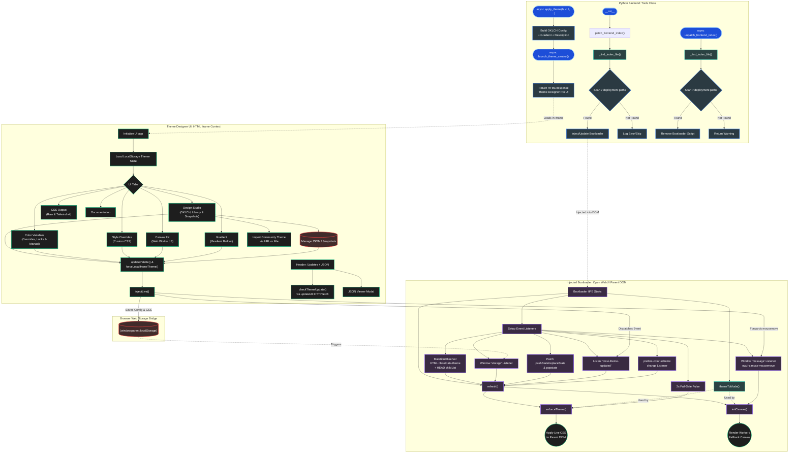

# 🎨 Theme Designer Pro

> Create, preview, manage, and apply custom colors for your Open WebUI instance in real-time — no code, no Docker rebuilds, no hassle.


---

Theme Designer Pro is an advanced, native-injection theming tool for Open WebUI. Powered by the modern OKLCH color space, it allows you to generate beautiful, perceptually uniform color palettes, design and manage cohesive Dark, OLED, Light, and Her modes simultaneously, and apply them instantly to your interface.

With its built-in bootloader injection, your custom themes persist seamlessly across page refreshes and container restarts/updates.

---

## ⚠️ Critical Setup Requirement

For this tool to function (Live Preview, Library, and Native Injection), you **must** enable the "Same Origin" sandbox flag in your Open WebUI settings. Without this, the tool cannot communicate with the main interface.

1. Go to **Settings** > **Admin Settings** > **Interface**.
2. Scroll to the **Artifacts** section.
3. Toggle **ON**: `iframe Sandbox: Allow Same Origin`.
4. Click `Save` and refresh the browser tab.

_For more details, see the [Open WebUI Documentation](https://docs.openwebui.com/features/extensibility/plugin/development/rich-ui#sandbox-and-security)._

---

## ✨ Key Features

- ⚡ **Real-Time Native Injection:** Modifies the Open WebUI interface instantly. No Docker container restarts or manual code pasting required.
- 🤖 **AI Color Consultant:** Describe the theme you want in natural language (e.g., _"warm copper dark theme"_) and the AI will translate your vision into precise OKLCH values, auto-generate a matching gradient, and open the designer with everything pre-applied for fine-tuning.
- 🌈 **OKLCH Color Engine:** Harness the power of Tailwind v4's OKLCH color spaces. Adjust Hue, Chroma, and Lightness to generate mathematically perfect, accessible tonal ramps. _(Pro-Tip: Double-click any slider label to instantly reset it to its default value)._
- 🖥️☀️🌌🌙❤️ **Multi-Mode Design Engine:** Switch between System, Dark, OLED, Light, and the elusive Her mode design views using the segmented toggle. A unified OKLCH foundation ensures your colors look mathematically perfect across all environments. _(Note: The 'Her' tab dynamically reveals itself by securely syncing with your Open WebUI administrator's `enable_easter_eggs` configuration in real-time via the `/api/config` endpoint)._
- 🌓 **True OS Integration & System Mode:** The System mode acts as a proxy, automatically swapping between your specific Light and Dark designs based on your Operating System's preference! The engine generates CSS utilizing native `@media (prefers-color-scheme)` blocks, guaranteeing your custom styles, variables, and Canvas FX seamlessly adapt even if browser class management is delayed.
- 🔄 **Selective Cross-Mode Synchronization:** Instantly duplicate your perfect setup from one mode to another using the "Sync" button. A powerful selective sync modal allows you to copy exactly what you need—whether it's the OKLCH Palette, Variable Overrides, Custom CSS, Canvas FX, Gradient Background, or Auth Visibility—to any combination of target modes simultaneously. Colored delta badges show you at a glance which settings differ between modes.
- 🔄 **Live Cross-UI Detection:** The tool actively listens to your environment. If you change the Open WebUI theme natively (via OS settings or keyboard shortcuts) while the designer is open, the tool will instantly switch its internal tab to match your live environment.
- 🔑 **Auth Page Theming:** Selectively opt-in your custom theme components (Foundation Colors, Custom CSS, Canvas FX, and Gradient Background) to display beautifully on the Open WebUI Login and Signup screens. By default, all auth visibility toggles (Colors, Custom CSS, Canvas FX, and Gradients) are enabled.
- 🎇 **Canvas FX Animations (Web Worker Powered):** Inject interactive JavaScript animations directly into the background of Open WebUI. The tool applies a _Structural Layer_ that makes native UI panels transparent. **Animations run on a Background Web Worker** for zero-lag performance, complete with a real-time status badge in the editor and an **iframe mouse-event bridge** that ensures your animations respond to cursor movement even when hovering over the Theme Designer interface!
- 👩💻 **IDE-Grade Custom CSS Editor:** Go beyond color variables. Write raw CSS directly within the tool to tweak specific UI elements. The editor features **Tab trapping (2-space indent), smart auto-indentation, auto-closing pairs (brackets, quotes, and parentheses), and a synced line number gutter** for lag-free editing. Save your favorite tweaks to the built-in **Custom CSS Preset Gallery**. You can also securely Import/Export individual CSS files! (Includes a smart parser that safely extracts and hoists your `@keyframes`!).
- 🛡️ **Auto-Scoped CSS Injection:** Write Custom CSS without fear of breaking other modes. The built-in Auto-Scope toggle automatically wraps your code in the correct CSS selectors (e.g., `.dark` or `[data-theme='light']`) to ensure your tweaks only apply when they should.
- 🎯 **Individual Variable Overrides & Manual CSS Variables:** Go beyond global adjustments. Use the "Color Variables" tab to hand-pick and override color variables with a native color picker — each swatch features an **`Aa` contrast preview badge** for at-a-glance legibility assessment. **Click directly on any variable name to instantly copy its CSS declaration (e.g., `--color-gray-800: #1a1a2e;`).** For advanced control, the **Manual Variable Overrides** code editor lets you write raw CSS custom property declarations that are injected _after_ the generated palette for maximum priority. Light, Dark, OLED, and Her modes maintain separate override lists for pixel-perfect fine-tuning.
- 🔒 **Smart Locking / Pinning:** Lock specific color variables using the 🔒 icon in the Color Variables tab (or use the bulk "Lock All" / "Unlock All" buttons). Locking a color completely pins it, protecting it from being changed by sliders, randomization, or image extraction. Perfect for keeping that "one perfect shade" while experimenting with others.
- 📋 **Smart Clipboard Parsing & Image Extraction:** Upload an image, or **simply press `Ctrl+V` to paste an image from your clipboard anywhere in the tool** to calculate dominant colors. The tool also features a Smart JSON paste listener—copy a Theme Designer JSON configuration from a friend, hit `Ctrl+V`, and the tool will instantly parse and prompt you to apply it (complete with a built-in security warning if untrusted Canvas FX scripts are detected!).
- 🎨 **Gradient Background Builder:** Design rich CSS gradient backgrounds using the dedicated **Gradient** tab. Choose between linear, radial, or conic gradient types, add and position color stops visually, control direction and intensity, and optionally enable smooth gradient animation. Includes a gallery of 12 built-in gradient presets (Midnight, Emerald, Amethyst, Sapphire, Aurora, Sunset, Ocean, Neon, Nebula, Lagoon, Ember, and Arctic). The gradient layer automatically applies the same structural transparency rules as Canvas FX and can coexist alongside it.
- 🔥 **Curated Presets:** Get started instantly with 8 beautiful built-in color presets including _Midnight_, _Emerald_, _Amber_, _Amethyst_, _Ruby_, _Sapphire_, _Topaz_, and _Obsidian_. Each preset comes bundled with a matching **glassmorphism-style gradient CSS theme** (transparent panels, backdrop blur, and custom gradient backgrounds) for a stunning out-of-the-box experience. When applied via Sync, a dialog will ask if you'd also like to load the complementary CSS.
- 📋 **Theme Metadata & Versioning:** When saving a snapshot, attach rich metadata — Name, Description, Author, Theme Version, Target WebUI Version, Repository URL, and a Theme Update URL. Metadata is embedded in exported `.json` files and preserved through imports, enabling a robust community theme sharing ecosystem.
- 🔄 **OTA Theme Update Checking:** Themes with a **Theme Update URL** can be checked for updates against a remote JSON endpoint. Use the per-snapshot ⟳ button or the global "Updates" header button to check all your themes at once. The tool performs a semantic version comparison and shows a detailed update modal with the current vs. available version, author, and description — then lets you apply the update with one click.
- 🌐 **Community Theme Import via URL:** Import themes directly from the web! The "Import" button opens a dual-mode dialog where you can paste a URL to a remote `theme.json` file and load it instantly, or use the classic file picker. Perfect for discovering and installing community-shared themes.
- 📦 **JSON Viewer:** Inspect your current theme state at any time using the "JSON" header button. The built-in JSON Viewer modal displays your full theme configuration in a read-only, formatted code block with Copy, Collapse, and validity badge indicators.
- 📚 **Theme Library & Snapshots:** Save multiple "Snapshots" of your designs. Each snapshot captures your entire configuration (Light mode, Dark mode, OLED mode, Her mode, Overrides, Locks, Manual Variable Overrides, Custom CSS, Canvas FX, and Gradient Background), allowing you to switch entire multi-mode themes with one click. Manage your library directly from the streamlined section header with inline Save, Import, Export, and **Search** buttons.
- 🔍 **Library Search, Filter & Sort:** Quickly find saved themes using the built-in search toggle, filter by feature tags (Custom CSS, Canvas FX, Overrides, or Linked/URL themes), and sort alphabetically or by creation order. Hovering a theme card reveals a rich tooltip with name, version, author, description, and color-coded feature tags. The same search feature is available in the CSS Snippet and Canvas Script galleries.
- 📦 **Mass Import, Export & Wipe Portability:** Download your entire snapshot library (or single themes, Canvas animations, and CSS snippets) as smart backups. Select and mass-import items at once via the file picker, or **seamlessly Drag & Drop JSON, JS, and CSS files directly onto the UI!** To clear out the clutter, each gallery features a dedicated "Trash" icon to permanently wipe specific collections in one click.
- 💾 **Persistent Storage & Auto-Save:** Automatically injects a lightweight, safe bootloader into your server's `index.html` so your theme loads instantly on every page refresh via `localStorage` and survives server restarts. Your active theme configuration is saved automatically after every change — no manual save button required.
- 🗂️ **Session Persistence:** Accidentally closed the chat while deep in the Style Overrides tab? The tool utilizes `sessionStorage` to remember exactly which tab you were working in.
- ⏪ **Undo & Redo History:** Made a mistake? Seamlessly step backward and forward through your color changes, variable overrides, CSS code edits, and gradient configurations using the built-in Undo/Redo footer buttons or standard `Ctrl+Z` / `Ctrl+Y` keyboard shortcuts.
- 📋 **CSS / Tailwind v4 Export:** The **CSS Output** tab provides two separate code views — Raw CSS and a Tailwind v4 `@theme` block — each with a **Minify toggle**, **Copy to Clipboard**, and **Download as `.css` file** (with smart filenames based on your active theme name).
- 👁️🗨️ **Self-Adapting UI & Contrast Protection:** The Theme Designer Pro interface dynamically themes _itself_ based on the colors you pick. It even includes built-in contrast protection, shifting text and border colors to remain legible if you create ultra-washed-out palettes.
- 🪄 **Native Open WebUI Aesthetic:** Meticulously designed to feel like a native part of Open WebUI, complete with custom-built, dependency-free tooltips and styled code blocks that perfectly match the host application's UI.
- 📱 **Fully Responsive:** The designer interface seamlessly adapts to mobile screens so you can tweak your theme on the go.
- ⏪ **Legacy Data Migration:** Upgrading from an older version of Theme Designer Pro? The tool automatically detects legacy data structures and gracefully migrates your saved snapshots and active themes to the latest format without data loss.
- ☢️ **Safe Nuclear & Factory Resets:** Messed up? The "Reset Mode" and "Global Reset" buttons safely clear out all custom colors set and styling, clear the injected `localStorage` data, and restore your Open WebUI instance back to its original look. The confirmation dialog gives you the option to create a backup snapshot in your library before wiping — just in case! For a truly clean slate, use the **Factory Reset** feature under the **Documentation** tab's Danger Zone section to permanently wipe all configuration data and your snapshot libraries.

---

## 🎭 Preset Gallery

A curated community collection of ready-to-import presets is available at:

**🔗 [github.com/silentoplayz/theme-designer-pro-presets](https://github.com/silentoplayz/theme-designer-pro-presets)**

| Category | Contents | Format |
|---|---|---|
| **Canvas FX** | 61 interactive background animations | `.js` |
| **CSS Presets** | 11 styling presets (glassmorphism, Neon Cyberpunk, and more) | `.css` |
| **Themes** | 34 complete multi-mode theme configurations | `.json` |
| **Gradients** | 13 gradient presets (linear, radial, mesh — still and animated) | `.json` |

### Quick Import

**Import everything at once** — paste this URL into any Import modal and click **Load URL**:

```
https://raw.githubusercontent.com/silentoplayz/theme-designer-pro-presets/main/bundles/everything.json
```

Or import individual categories:

| Bundle | URL |
|---|---|
| All Canvas FX | `https://raw.githubusercontent.com/silentoplayz/theme-designer-pro-presets/main/bundles/canvas-fx-all.json` |
| All CSS Presets | `https://raw.githubusercontent.com/silentoplayz/theme-designer-pro-presets/main/bundles/css-presets-all.json` |
| All Themes | `https://raw.githubusercontent.com/silentoplayz/theme-designer-pro-presets/main/bundles/themes-all.json` |
| All Gradients | `https://raw.githubusercontent.com/silentoplayz/theme-designer-pro-presets/main/bundles/gradients-all.json` |

You can also import individual presets by pasting any file's GitHub URL directly — Theme Designer Pro auto-converts `github.com` URLs to raw content.

---

## 🛠️ Usage Instructions

1. **Install the Tool:** Import this tool into your Open WebUI workspace.
2. **Invoke the Designer:** In a chat, simply ask your AI:
   > _"Launch the Theme Designer"_ or _"Open Theme Designer Pro"_
3. **Design your Theme:** The AI will execute the tool and render the Theme Designer Pro interface.
4. **Customize:**
   - Use the **Segmented Toggle** to switch between System, Dark, OLED, Light, and Her mode design views.
   - Use the sliders on the **Design Studio** tab to adjust your foundation colors.
   - Hover and click over the **Tonal Ramp** to quickly copy mathematically generated HEX values.
   - Switch to the **Color Variables** tab to override and lock specific shades with the built-in color picker. Click a variable name to copy its CSS declaration instantly. Use the **Manual Variable Overrides** code block below the grid for direct CSS custom property control.
   - Switch to the **Style Overrides** tab to write raw CSS tweaks.
   - Switch to the **Canvas FX** tab to inject interactive JavaScript background animations.
   - Switch to the **Gradient** tab to design gradient backgrounds using the visual builder or apply a gradient preset.
   - Use the **JSON** header button to inspect or copy your full theme state.
   - Use the **Updates** header button to check all your themes for available updates.

**Pro-Tip for Custom CSS:** Not sure what to target? Press `F12` (or right-click > Inspect) to open your browser's Developer Tools. Use the element picker to find the exact class names used by Open WebUI (e.g., `.chat-bubble` or `#sidebar`).

### 🤖 AI-Driven Theming

Instead of manually tweaking sliders, you can ask your AI to design a theme for you. The AI translates your description into OKLCH color values and applies them directly:

> _"Give me a warm copper dark theme"_
> _"I want a cool ocean blue look, very dark"_
> _"Create a muted lavender theme for OLED mode only"_

The AI calls the `apply_theme()` tool with the following parameters:

| Parameter     | Type   | Default    | Description                                                                                      |
| ------------- | ------ | ---------- | ------------------------------------------------------------------------------------------------ |
| `hue`         | `int`  | _required_ | Color hue angle (0–360). 0=red, 25=orange, 50=yellow, 120=green, 210=blue, 290=purple, 330=pink. |
| `chroma`      | `int`  | _required_ | Color saturation (0–40). Low=muted, medium=balanced, high=vivid.                                 |
| `lightness`   | `int`  | _required_ | Base lightness (5–30). Lower=darker.                                                             |
| `gradient`    | `bool` | `true`     | Auto-generate a matching 4-stop gradient background from the hue.                                |
| `description` | `str`  | `""`       | Theme name displayed in the confirmation toast (e.g., _"Warm Copper"_).                          |
| `mode`        | `str`  | `"all"`    | Target mode(s): `"all"`, `"dark"`, `"oled"`, `"light"`, or `"her"`.                              |

The designer opens with the theme pre-applied, a confirmation toast showing what was set, and all sliders ready for fine-tuning.

---

## 🔧 Admin Valves (Server Configuration)

Theme Designer Pro exposes **8 admin-controlled Valves** through the Open WebUI Admin Panel. These allow server administrators to gate security-sensitive features, restrict content imports, and enforce limits — all without touching code.

To configure Valves, go to **Workspace** > **Tools** > **Theme Designer Pro** > **⚙️ (Gear Icon)**.

| Valve                           | Type   | Default | Description                                                                                                                                                                                    |
| ------------------------------- | ------ | ------- | ---------------------------------------------------------------------------------------------------------------------------------------------------------------------------------------------- |
| **Enable Custom CSS**           | `bool` | `true`  | Allow the Style Overrides (custom CSS) editor. When disabled, the Style Overrides tab is hidden.                                                                                               |
| **Enable Canvas FX**            | `bool` | `true`  | Allow Canvas FX (JavaScript background animations). When disabled, the Canvas FX tab is hidden **and** running animations are suppressed via the bootloader.                                   |
| **Enable Gradient Builder**     | `bool` | `true`  | Allow the Gradient Background builder. When disabled, the Gradient tab is hidden.                                                                                                              |
| **Enable Auth Page Theming**    | `bool` | `true`  | Allow theming the login/signup pages. When disabled, all "Show on Auth Pages" toggles are hidden and forced off in localStorage.                                                               |
| **Enable URL Import**           | `bool` | `true`  | Allow importing themes, CSS snippets, and canvas scripts from remote URLs. When disabled, all URL import buttons are hidden and the `loadFromUrl` function shows an admin restriction message. |
| **Allowed Import Domains**      | `str`  | `""`    | Comma-separated allowlist of domains for URL imports (e.g. `raw.githubusercontent.com, openwebui.com`). Empty = allow all. Only applies when **Enable URL Import** is `true`.                  |
| **Max Snapshots Per User**      | `int`  | `0`     | Maximum number of theme snapshots a user can save. When the limit is reached, saves are blocked with an error message. `0` = unlimited.                                                        |
| **Enable Bootloader Injection** | `bool` | `true`  | Inject the theme persistence bootloader into `index.html` on tool init. Disable for read-only or ephemeral deployments.                                                                        |

> **Note:** All Valves default to their most permissive values, meaning Theme Designer Pro behaves identically to an un-valved installation out of the box. Admins only need to configure Valves if they want to restrict specific features.

---

## 🎨 Custom CSS: Changing Fonts

You can easily change the global font family for your entire Open WebUI instance by pasting a simple CSS rule into the **Style Overrides** tab.

Because Open WebUI relies heavily on Tailwind utility classes for its typography, using the global selector (`*`) with `!important` is the cleanest way to force a unified look. You can replace the font names inside the quotes with any locally installed system font.

Here are a few quick copy-paste examples:

**1. The "Native OS" Vibe** (Uses San Francisco on Mac, Segoe on Windows for a clean, premium feel)

```css
body,
input,
textarea,
button,
select,
* {
	font-family:
		-apple-system, BlinkMacSystemFont, 'SF Pro Display', 'Segoe UI', Roboto, Helvetica, sans-serif !important;
	letter-spacing: -0.01em !important;
}
```

**2. The "Hacker Terminal" Vibe** (Forces monospace coding fonts)

```css
body,
input,
textarea,
button,
select,
* {
	font-family: 'JetBrains Mono', 'Fira Code', 'Consolas', 'Courier New', monospace !important;
}
```

**3. The "Editorial" Vibe** (A clean, highly readable Serif font)

```css
body,
input,
textarea,
button,
select,
* {
	font-family: 'Georgia', 'Cambria', 'Times New Roman', serif !important;
	line-height: 1.65 !important;
}
```

_Simply paste one of these into the Style Overrides editor for your desired mode, ensure "Enabled" is checked, and watch the UI font transform instantly!_

---

## 🚀 How It Works (Under the Hood)

Theme Designer Pro utilizes a unique hybrid architecture, combining a Python backend execution with a sandboxed frontend UI to safely theme your instance without requiring complicated server overrides. Here is exactly what happens when you use it:

1. **The Backend Bootloader Injection:**
   When the AI initializes the tool, the Python script calls its `_find_index_file()` helper to locate your Open WebUI server container's core `index.html` file (checking 7 deployment paths including `/app/backend/public/index.html`, `/app/backend/open_webui/frontend/index.html`, `/app/build/index.html`, and several relative fallback paths). Once found, it surgically injects an advanced `owui-theme-bootloader` script into the `<head>` of the document. This is a one-time server modification.
2. **The Sandboxed Designer UI:**
   The tool renders a rich, interactive HTML interface inside an iframe within your chat. Because you enabled the **"Allow Same Origin"** sandbox flag, this iframe is granted permission to communicate directly with the parent Open WebUI window (`window.parent`).
3. **Real-Time Code & Canvas Orchestration:**
   As you tweak sliders, pick colors, write custom CSS, or enable Canvas scripts, the UI calculates the OKLCH mathematical color ramps and compiles them. It then reaches into the parent window and injects/updates the global `<style id="owui-dev-live-theme">` tag, and spawns a dynamic, worker-threaded `<canvas>` layer for background animations. An iframe mouse-event bridge ensures Canvas FX animations respond to cursor movement even when hovering over the Designer's own interface.
4. **Selective Route Enforcement (Auth Pages):**
   The bootloader actively monitors your current URL via a `themeToMode()` helper that maps Open WebUI theme strings to internal mode keys. If it detects you are on the `/auth` (Login/Signup) pages, it intercepts the theme injection and strictly applies _only_ the specific features (Colors, CSS, Canvas, or Gradient) you explicitly enabled for auth pages via the UI toggles.
5. **Browser Local Storage:**
   Simultaneously, the compiled code and your library data are saved locally to your web browser's `localStorage` (under the keys `owui_dev_theme_v1_css` and `owui_dev_theme_v1`). Your theme data never touches the Open WebUI backend database, ensuring total safety and keeping your server lightweight.
6. **The Persistent SPA Boot Loop:**
   If you close the tab and come back later, the Python tool isn't running anymore—but it doesn't need to be! The bootloader script executes the moment you open Open WebUI. It calls its internal `refresh()` function, which reads your `localStorage`, applies your CSS via `enforceTheme()`, and spins up your Canvas FX via `initCanvas()` before the app even finishes rendering. It hooks into native `history.pushState` logic, utilizes a `MutationObserver` (watching both `<html>` class/data-theme attributes and `<head>` child elements), a `prefers-color-scheme` media query listener, and a 2-second fail-safe pulse to ensure your theme and animations survive seamlessly during Single Page Application (SPA) navigations!

---

## ❓ Troubleshooting & FAQ

- **My theme disappears when I open an Incognito/Private window.**
  - _Reason:_ The theme engine utilizes your browser's `localStorage` to save your colors locally. Incognito mode uses a fresh, empty storage state, so your theme will not carry over.
- **I get a "Sandbox Configuration Required" error and the tool won't open.**
  - _Fix:_ You must enable the "Allow Same Origin" iframe sandbox flag in your Admin Settings. Please refer to the **Critical Setup Requirement** section at the top of this document.
- **The console shows a Python permission error when injecting the bootloader.**
  - _Reason:_ The Python tool must have write access to your Open WebUI `index.html` file. If you are running a highly restricted bare-metal deployment or custom volume mappings, the tool cannot inject the persistence script.
- **Canvas FX animations are lagging my browser.**
  - _Fix:_ Heavy mathematically complex animations can drain resources. Ensure your browser supports `OffscreenCanvas` (indicated by the green "Background Worker" badge in the UI). If it says "Main Thread (Fallback)", keep your animations simple.

---

## 🗑️ Uninstallation & Complete Removal

Because this tool injects a bootloader script directly into your server's `index.html` file, **simply deleting the tool from your Open WebUI workspace will not remove the theme engine from your interface.**

To fully remove Theme Designer Pro, revert your styles, and purge all saved data, follow these steps exactly:

**Step 1: Purge Browser LocalStorage & Saved Data**
The easiest way to clear your saved data is to launch Theme Designer Pro, navigate to the **Documentation** tab, and click the red **Factory Reset (Wipe All Data)** button under the Danger Zone section (Section 18). After confirming your choice, this will instantly and permanently delete your themes, snapshots, and local configuration.

_Alternatively, if you cannot access the tool UI:_

1.  Open your **Open WebUI instance** in your browser.
2.  Press `F12` (or `Cmd+Opt+I` on Mac) to open the Developer Tools.
3.  Go to the **Console** tab.
4.  Paste the following command and press **Enter**:
    ```javascript
    [
    	'owui_dev_theme_v1',
    	'owui_dev_theme_v1_css',
    	'owui_theme_snapshots',
    	'owui_canvas_presets',
    	'owui_css_presets',
    	'owui_gradient_presets',
    	'owui_canvas_last_mode',
    	'owui_canvas_last_script',
    	'owui_theme_last_metadata',
    	'owui_theme_valve_no_canvas'
    ].forEach((k) => {
    	localStorage.removeItem(k);
    	console.log('Purged: ' + k);
    });
    location.reload();
    ```
    _Note: This command must be run while you are on your Open WebUI page to target the correct origin storage._

**Step 2: Remove the Server Bootloader Injection**
Deleting the tool doesn't "un-patch" the HTML file. You must remove the injected script from the server's filesystem:

- **The AI Way (Easiest):** In a chat with the tool enabled, simply ask your AI: _"Remove the theme bootloader"_. The AI will call the built-in `unpatch_frontend_index()` tool method, which cleanly strips the bootloader from `index.html` and confirms the removal.
- **The Docker Way:** If you are using Docker, simply restart or update your container (e.g., `docker compose down && docker compose up -d`). This replaces the patched `index.html` with a fresh copy from the image.
- **The Manual Way:** If you cannot restart the container, you must manually edit the `index.html` file on your server. The tool checks 7 deployment paths — the most common are `/app/backend/public/index.html`, `/app/backend/open_webui/frontend/index.html`, and `/app/build/index.html` (plus several relative fallback paths for bare-metal/dev setups). Open the file and delete the entire block of code wrapped in these markers:
  ```html
  <!-- OWUI Theme Pro Bootloader -->
  ... (bootloader code) ...
  </script>
  ```

---

## ⚠️ Important Notes & System Requirements

- **Required Open WebUI Version:** `0.9.0` or higher.
- **Server Access:** Because this tool uses a bootloader script to persist themes natively, the Python environment running the tool needs write access to the `index.html` file (typically `/app/backend/public/index.html` for the default Open WebUI Docker container).
- **Browser Local Storage:** Themes (and individual overrides) are saved per-browser. If you switch from Chrome to Safari, or from Desktop to Mobile, you will need to launch the tool and set your theme again (or use the JSON export/import feature to sync your library).
- **Resetting:** The "Reset" and "Global Reset" buttons clear your current active styles but keep your Library snapshots perfectly safe.

---

## ⚖️ Compliance & Legal Disclaimer

**Theme Designer Pro is a tool provided for educational and customization purposes. By using this tool, you acknowledge and agree to the following:**

- **Compliance Responsibility:** As of Open WebUI v0.6.6+, the software license strictly prohibits altering, removing, obscuring, or replacing any "Open WebUI" branding (including the name, logo, or distinguishing visual identifiers) in deployments with **more than 50 active users** in a 30-day period without an Enterprise License.
- **Administrative Burden:** The responsibility to ensure compliance with the Open WebUI License rests **entirely** with the server administrator. While modifying color palettes is permitted, you must ensure that your use of this tool (specifically the Style Overrides tab) is not used to hide, obscure, or alter the Open WebUI logo and branding in violation of the license.
- **Liability Waiver:** The author of Theme Designer Pro (@g30) shall not be held liable for any material breach of license, legal action, or service termination resulting from the use or misuse of this tool on a hosted or distributed Open WebUI instance.
- **Safe Harbor:** If your deployment is for personal use, internal team use (with permission), or for an organization of 50 or fewer active users, you are generally exempt from these strict branding restrictions.

This tool is provided "as is" without warranty of any kind. By using **Theme Designer Pro**, you acknowledge that modifying system files (index.html) and enabling "Same Origin" sandbox flags may have security implications. Use only on trusted instances.

_For more information, see the official [Open WebUI License Guide](https://github.com/open-webui/docs/blob/main/docs/license.mdx)._

---

## ⚠️ Canvas FX Performance Disclaimer

The Canvas FX feature allows you to inject custom JavaScript animations directly into the background of Open WebUI. These animations execute on a dedicated **Background Web Worker (OffscreenCanvas)** by default! This ensures your chat interface remains silky smooth without blocking the main browser thread.

_(Note: If your browser does not support `OffscreenCanvas`, the tool will seamlessly fall back to executing on the main thread)._

Even with Web Workers, writing, generating, or importing highly intensive animations (e.g., massive particle counts or heavy mathematical calculations) can still heavily consume CPU/GPU resources and drain battery life. Use this feature responsibly, test your custom scripts thoroughly, and keep your animations lightweight to maintain a smooth chatting experience!

---

## 💡 Maintenance & Stability (PSA)

Open WebUI is a fast-moving project. Because this tool relies on creative DOM injection to bypass the lack of a native CSS panel, future UI updates to Open WebUI might break it. I offer no guarantees that it will work flawlessly forever across all future versions, so make sure to use that export button to back up your favorite JSON themes just in case!

---



---

## Requirements

- **Open WebUI** ≥ 0.9.0
- **Admin access** to enable the "Allow Same Origin" iframe sandbox flag
- **Server write access** to `index.html` (automatic in default Docker deployments)

No additional Python dependencies are required beyond what Open WebUI provides.

---

## License

[MIT](https://opensource.org/licenses/MIT) — © [@G30](https://openwebui.com/u/g30)

**Support:** If you love this tool, consider supporting [Open WebUI](https://github.com/open-webui) or [buying me a coffee](https://buymeacoffee.com/iamg30).
